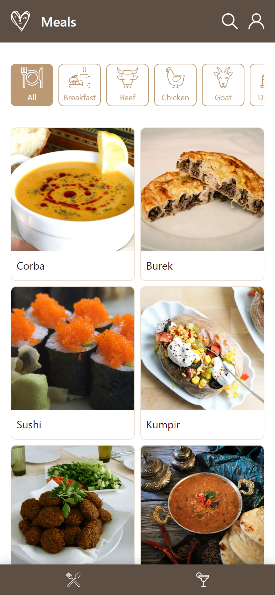

# MAIS VOCE APP

  

 

## O que é? / What is it?
O Mais Voce é um aplicativo de receitas de comida e bebida, onde o usuário pode pesquisar por receitas, filtrar por categoria, nome e ingredientes, além de poder favoritar receitas e acessar receitas favoritas.

 

#### EN-US
Mais Voce is a recipe app for food and drink, where the user can search for recipes, filter by category, name and ingredients, as well as being able to favorite recipes and access favorite recipes.
 
 

## Tecnologias utilizadas / Technologies used
- React
- Redux Toolkit
- React Router
- React Hooks
- SCSS

 

## Quem fez? / Who made it?
- [Pedro Silva](https://github.com/opedrodev)
- [Gabriel Palhares](https://github.com/GPalhares)
- [Gabriel Matina](https://github.com/gabrielmatina)
- [Malu Brandão](https://github.com/malubrandaor)
- [Lucas Daniel](https://github.com/LDRezende)
- [Flavio Ramon](https://github.com/flavioramonnunes)

 

## Como usar? / How to use?
- Live Demo: [Mais Voce](https://maisvoce.opedro.dev/)

- *Use this application in mobile devices!*
